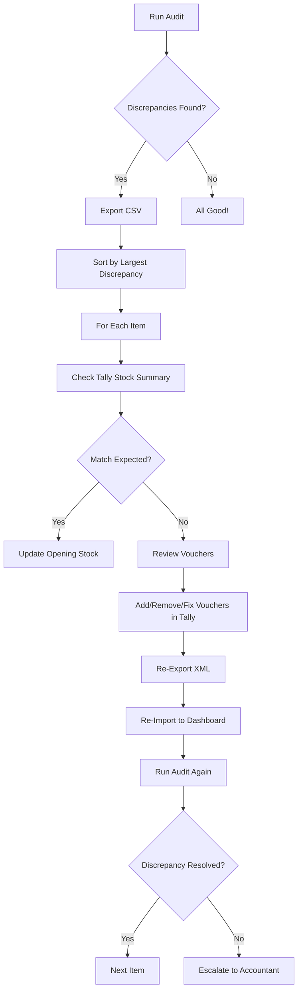

# Inventory Discrepancies Explained

## Overview
The audit engine runs automatically when data is imported in development mode. It verifies the fundamental inventory equation for every item:

```
CLOSING STOCK = OPENING STOCK + INWARDS - OUTWARDS
```

## What the 44 Discrepancies Mean

**44 item(s) with inventory discrepancies** means there are 44 items where the **expected closing stock** (calculated from the formula above) does **NOT match** the **computed closing stock** (calculated by summing all voucher movements).

### Formula Breakdown

#### Expected Closing
```
Expected = Opening + (Purchase + Credit Note + Stock Journal In) - (Sales + Debit Note + Stock Journal Out)
```

#### Computed Closing
```
Computed = Opening + Σ(all voucher movements for this item)
```

If `|Expected - Computed| > 0.000000001`, the item is flagged as having a discrepancy.

## Common Causes

### 1. **Missing Vouchers**
- Some transactions not exported from Tally
- Date range filters excluding certain vouchers
- Cancelled vouchers incorrectly included/excluded

### 2. **Incorrect Opening Stock**
- Opening stock value in Tally doesn't match reality
- Previous FY closing stock not rolled over correctly

### 3. **Rounding Errors**
- Tally uses 2-4 decimal precision for quantities
- Accumulated rounding across hundreds of transactions
- Unit conversion errors (BASE ↔ PKG)

### 4. **Voucher Type Misclassification**
- Stock adjustments recorded as Sales instead of Stock Journal
- Returns not properly recorded as Credit/Debit Notes
- Manual journal entries affecting inventory without item lines

### 5. **Data Integrity Issues**
- Duplicate vouchers with same GUID
- Vouchers modified after export
- Concurrent editing in Tally during export

### 6. **Stock Journal Sign Issues**
- Stock Journal OUT recorded as positive instead of negative
- Quantity direction not matching source/destination logic

## How to Investigate

### Step 1: Run Audit
1. Go to **Settings** page
2. Click **Run Audit** in Diagnostics section
3. Review audit results

### Step 2: Expand Discrepancies
1. Click on **"44 item(s) with inventory discrepancies"** to expand
2. See table with columns:
   - **Item**: Item name
   - **Opening**: Opening stock quantity
   - **In**: Total inwards (Purchase + Credit Note + Stock Journal In)
   - **Out**: Total outwards (Sales + Debit Note + Stock Journal Out)
   - **Discrepancy**: Difference between expected and computed

### Step 3: Export for Analysis
1. Click **Export Discrepancies CSV** button
2. Download `inventory_discrepancies_YYYY-MM-DD.csv`
3. Open in Excel/Google Sheets
4. Sort by largest discrepancy to prioritize investigation

### Step 4: Check Browser Console
1. Open Developer Tools (F12)
2. Look for `[AUDIT] Inventory discrepancies found:` log
3. Detailed table shows:
   - Item name
   - Opening, Inwards, Outwards
   - Expected vs Computed closing
   - Discrepancy value

### Step 5: Cross-Reference with Tally
1. For each discrepant item, open Tally
2. Check **Stock Summary** report for that item
3. Compare opening, inwards, outwards with our data
4. Verify closing stock matches Tally's calculation

## Example Analysis

### Sample Discrepancy
```
Item: "SPOKE 12G SS 254MM BLK TRIM FIT"
Opening: 0.00
Inwards: 1440.00  (Purchase)
Outwards: 1440.00 (Sales)
Expected Closing: 0.00
Computed Closing: -2.00
Discrepancy: 2.00
```

**Analysis**:
- Expected closing is 0 (balanced in/out)
- Computed closing is -2 (negative stock!)
- **Root Cause**: Likely 2 units were sold before they were purchased (wrong dates or missing purchase voucher)
- **Fix**: Check Tally for missing purchase voucher or incorrect sales date

## Negative Stock Items

**9 item(s) with negative stock** means items where computed closing stock < 0.

### Common Causes
1. **Sales before Purchase**: Items sold before they arrived
2. **Incorrect Opening Stock**: Opening stock too low
3. **Missing Purchase Vouchers**: Some purchases not imported
4. **Wrong Dates**: Sales dated before actual purchase date

### How to Fix
1. Verify opening stock in Tally matches reality
2. Check if all purchase vouchers for these items are imported
3. Review sales voucher dates vs purchase voucher dates
4. Add stock adjustment journal if needed

## Items Without GST Rates

**503 item(s) without GST rates** means items where `gstRate === null`.

### Impact
- Cannot create sales invoices for these items (GST calculation fails)
- Tax reports will be incomplete
- Compliance risk

### How to Fix
1. Go to Tally → Masters → Stock Items
2. For each item, edit and set appropriate GST rate:
   - 0% (exempt items)
   - 5% (essential goods)
   - 12% (standard goods)
   - 18% (most goods)
   - 28% (luxury goods)
3. Re-export data from Tally
4. Re-import into dashboard

Alternatively, use **Unit Configuration Excel** feature in Settings to bulk-update GST rates (future enhancement).

## Resolution Workflow

### For Inventory Discrepancies



### Quick Fixes

1. **Small Discrepancies (< 0.01)**
   - Likely rounding errors
   - Safe to ignore or adjust opening stock by discrepancy amount

2. **Medium Discrepancies (0.01 - 10)**
   - Check for missing vouchers
   - Verify unit conversions (BASE vs PKG)
   - Review stock journal entries

3. **Large Discrepancies (> 10)**
   - **CRITICAL**: Major data integrity issue
   - Full voucher reconciliation required
   - Compare with physical stock count
   - May require Tally data correction

## Technical Details

### Audit Engine Location
- File: `src/engine/audit.ts`
- Function: `auditAllItems()`
- Triggered: Automatically on data import in dev mode
- Epsilon: 1e-9 (0.000000001) tolerance for floating-point comparison

### Data Flow
1. `dataStore.setData()` called when data imported
2. Triggers `import("../engine/audit").then(({ auditAllItems }) => ...)`
3. Runs audit and logs to console
4. Stores results in `auditResults` state (Settings page)

### Voucher Types Tracked

| Voucher Type | Effect on Stock |
|-------------|----------------|
| Purchase | +Inwards |
| Credit Note | +Inwards (returns to us) |
| Stock Journal (positive) | +Inwards |
| Sales | +Outwards |
| Debit Note | +Outwards (returns from us) |
| Stock Journal (negative) | +Outwards |

### Excluded from Audit
- **Cancelled vouchers** (`isCancelled === true`)
- **Optional vouchers** (`isOptional === true`)
- **Non-inventory lines** (ledger-only lines)

## Next Steps

After reviewing discrepancies:
1. ✅ Fix root causes in Tally (missing vouchers, wrong dates, incorrect opening stock)
2. ✅ Re-export corrected data from Tally
3. ✅ Re-import into dashboard
4. ✅ Run audit again to verify fixes
5. ✅ Aim for **0 discrepancies** before going to production

## Production Readiness

Current Status: **NOT READY FOR PRODUCTION**

Criteria for production:
- [ ] 0 inventory discrepancies (all items pass audit)
- [ ] 0 negative stock items
- [ ] All items have GST rates configured
- [ ] Monthly chain validation passes (closing[i] === opening[i+1])
- [ ] Invoice balance matches (billed - paid = outstanding)

Once all criteria met → **Production Ready** ✅
